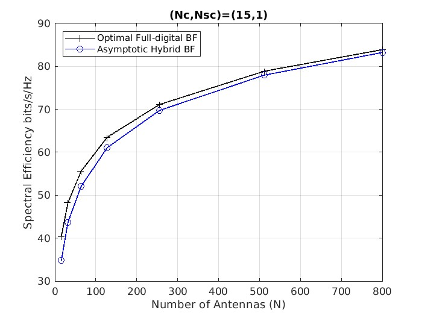

# SimLit-2017-JSAC-Sohrabi

This repo is to reproduce the paper

F. Sohrabi and W. Yu, "Hybrid Analog and Digital Beamforming for mmWave OFDM Large-Scale Antenna Arrays," in IEEE Journal on Selected Areas in Communications, vol. 35, no. 7, pp. 1432-1443, July 2017, doi: 10.1109/JSAC.2017.2698958.

(a) mmWave channel model with $(N_c,N_sc)=(15,1)$

(b) mmWave channel model with $(N_c,N_sc)=(5,10)$

Fig. 3. Comparison between the achievable rates of asymptotic design and the optimal fully-digital beamforming for an $N\times N$ MIMO system with $N_s=N_{RF}=4$, $K=32$ and $\mathrm{SNR}=20\mathrm{dB}$.